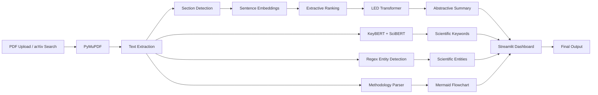

# AI-Powered Research Paper Summarizer

> An NLP-powered application that automatically summarizes long scientific research papers using a hybrid Extractive–Abstractive pipeline. The system supports PDF uploads and arXiv integration, extracts scientific keywords and entities, generates methodology flowcharts, and provides an interactive interface for efficient literature review.


---

# Table of Contents

- [Overview](#overview)
- [Problem Statement](#problem-statement)
- [Key Features](#key-features)
- [System Architecture](#system-architecture)
- [Processing Pipeline](#processing-pipeline)
- [Technology Stack](#technology-stack)
- [Project Structure](#project-structure)

---

# Overview

Scientific research papers contain valuable knowledge but are often lengthy, highly technical, and time-consuming to understand. Researchers and students spend a significant amount of time reading multiple papers before identifying the most relevant information.

This project presents an AI-powered research paper summarization system that automatically extracts and summarizes important information from scientific publications using modern Natural Language Processing (NLP) techniques.

The system combines semantic extractive summarization with transformer-based abstractive summarization to generate concise, coherent, and context-aware summaries while preserving the technical meaning of the original paper.

In addition to summarization, the application extracts scientific keywords, identifies important entities such as models and datasets, and generates methodology flowcharts to improve comprehension of research workflows.

The application provides a simple Streamlit-based interface where users can upload research papers in PDF format or retrieve papers directly from arXiv.

---

# Problem Statement

With thousands of scientific papers published every day, manually reviewing literature has become increasingly challenging.

Traditional summarization techniques often suffer from one or more of the following limitations:

- Poor understanding of scientific terminology
- Loss of contextual information
- Fragmented sentence selection
- Inability to process long research papers
- Lack of structured insights for technical documents

This project addresses these challenges by combining extractive and abstractive NLP techniques specifically designed for long scientific documents.

---

# Key Features

- Automatic research paper summarization
- Upload research papers in PDF format
- Search and retrieve papers directly from arXiv
- Hybrid Extractive + Abstractive summarization pipeline
- Long document processing using LED Transformer
- Scientific keyword extraction using KeyBERT and SciBERT
- Scientific entity extraction
- Section-wise summarization
- Automatic methodology flowchart generation
- Interactive Streamlit web application
- Export generated summaries
- Docker support for deployment

---

# System Architecture



---

# Processing Pipeline

```
Research Paper
       │
       ▼
PDF Extraction
       │
       ▼
Text Cleaning
       │
       ▼
Section Detection
       │
       ▼
Sentence Embedding Generation
       │
       ▼
Extractive Sentence Ranking
       │
       ▼
LED Abstractive Summarization
       │
       ▼
Keyword Extraction
       │
       ▼
Entity Recognition
       │
       ▼
Methodology Flowchart
       │
       ▼
Interactive Streamlit Interface
```

---

# Technology Stack

| Category | Technology |
|-----------|------------|
| Programming Language | Python |
| Frontend | Streamlit |
| Deep Learning Framework | PyTorch |
| NLP Framework | Hugging Face Transformers |
| Abstractive Summarization | LED (Longformer Encoder Decoder) |
| Extractive Summarization | Sentence Transformers |
| Keyword Extraction | KeyBERT |
| Scientific Embeddings | SciBERT |
| PDF Processing | PyMuPDF |
| Data Source | arXiv API |
| Deployment | Docker |
| Version Control | Git & GitHub |

---

# Project Structure

```text
Research-Paper-Summarizer
│
├── data/
├── models/
├── notebooks/
├── references/
├── reports/
├── scripts/
├── src/
│   ├── backend/
│   └── frontend/
│
├── README.md
├── docker-compose.yaml
├── .gitignore
└── ResearchPaperSummarizer.ipynb
```

# Workflow

The application follows a hybrid NLP pipeline to generate structured summaries from long scientific research papers.

1. **Paper Acquisition**
   - Upload a research paper in PDF format.
   - Or fetch papers directly from the arXiv API.

2. **PDF Processing**
   - Extract text using PyMuPDF.
   - Remove unnecessary whitespace and formatting.
   - Divide the paper into logical sections.

3. **Extractive Summarization**
   - Generate sentence embeddings using Sentence Transformers.
   - Rank sentences based on semantic similarity.
   - Select the most informative sentences.

4. **Abstractive Summarization**
   - Feed extracted content into the LED (Longformer Encoder-Decoder) model.
   - Generate a coherent summary while preserving context.

5. **Keyword & Entity Extraction**
   - Extract scientific keywords using KeyBERT with SciBERT embeddings.
   - Detect models, datasets, metrics and algorithms using rule-based entity recognition.

6. **Methodology Visualization**
   - Parse procedural text.
   - Automatically generate Mermaid-based methodology flowcharts.

7. **Result Generation**
   - Display summaries, keywords, entities and flowcharts through the Streamlit interface.

---

# Models & Algorithms

## LED (Longformer Encoder Decoder)

LED is the primary abstractive summarization model used in the project.

**Why LED?**

- Designed for long documents
- Handles significantly larger context windows than traditional transformers
- Produces fluent and coherent summaries
- Preserves contextual information throughout lengthy research papers

---

## Sentence Transformers

Sentence Transformers generate semantic embeddings for every sentence in the document.

These embeddings are used for:

- Semantic similarity computation
- Sentence ranking
- Extractive summarization

---

## KeyBERT + SciBERT

KeyBERT extracts important scientific keywords using contextual embeddings generated by SciBERT.

The extracted keywords include:

- Models
- Algorithms
- Datasets
- Technical concepts
- Scientific terminology

---

## PyMuPDF

PyMuPDF is responsible for:

- Reading uploaded PDFs
- Extracting text
- Preserving document structure
- Preparing content for downstream NLP processing

---

# Why a Hybrid Summarization Pipeline?

Instead of relying on a single summarization technique, this project combines extractive and abstractive approaches.

| Extractive Summarization | Abstractive Summarization |
|--------------------------|---------------------------|
| Selects important sentences | Generates new coherent sentences |
| Preserves factual accuracy | Produces fluent summaries |
| Helps retain important details | Improves readability |

The hybrid approach leverages the strengths of both techniques, resulting in summaries that are both informative and easy to understand.

---

# Installation

Clone the repository

```bash
git clone https://github.com/<your-username>/Research-Paper-Summarizer.git

cd Research-Paper-Summarizer
```

---

Create a virtual environment

```bash
python -m venv venv
```

Activate the environment

### Windows

```bash
venv\Scripts\activate
```

### Linux / macOS

```bash
source venv/bin/activate
```

---

Install backend dependencies

```bash
pip install -r src/backend/requirements_backend.txt
```

Install frontend dependencies

```bash
pip install -r src/frontend/requirements_frontend.txt
```

---

# Running the Project

Start the backend

```bash
cd src/backend

python main.py
```

Open another terminal and start the frontend

```bash
cd src/frontend

streamlit run app.py
```

Once both services are running, open the Streamlit URL displayed in the terminal.

---

# Docker Deployment

To run the application using Docker:

```bash
docker-compose up --build
```

This automatically builds the required containers and launches both the backend and frontend.

---

# Usage

1. Launch the application.
2. Upload a research paper in PDF format or search for one using the arXiv integration.
3. The application processes the document.
4. View:
   - Generated summary
   - Scientific keywords
   - Extracted entities
   - Methodology flowchart
5. Export the generated results.

---

# Input

The application accepts:

- Research papers in PDF format
- Papers retrieved using the arXiv API

---

# Output

The generated output includes:

- Abstractive summary
- Extractive summary
- Scientific keywords
- Named entities
- Section-wise summaries
- Methodology flowchart
- Interactive visualization through Streamlit

---

# Key Contributions

- Designed a hybrid extractive–abstractive summarization pipeline.
- Implemented long-document summarization using the LED Transformer.
- Integrated scientific keyword extraction using KeyBERT and SciBERT.
- Added automatic methodology flowchart generation.
- Built a complete end-to-end Streamlit application with PDF upload and arXiv integration.
- Containerized the application using Docker for reproducible deployment.

---

The following sections describe the implementation details, NLP models, workflow, experimental evaluation, installation instructions, and usage of the system.

# Experimental Results

The proposed hybrid summarization pipeline was evaluated on multiple scientific research papers obtained through both PDF uploads and the arXiv API.

The generated summaries consistently captured the primary research objective, methodology, and experimental findings while significantly reducing the amount of text required for manual reading.

---

# Performance Summary

| Metric | Observation |
|----------|------------|
| Input Documents | Long scientific research papers |
| Summary Length | Approximately 20–30% of original paper |
| Context Preservation | High |
| Technical Terminology | Preserved |
| Scientific Keyword Extraction | Accurate |
| Long Document Handling | Excellent |
| Overall Readability | High |

---

# BERTScore Evaluation

The generated summaries were evaluated using **BERTScore**, which measures semantic similarity between generated summaries and reference summaries.

| Metric | Score |
|---------|------:|
| Precision | **0.8438** |
| Recall | **0.8761** |
| F1 Score | **0.8597** |

The evaluation indicates that the generated summaries retain most of the semantic information present in the original research papers while remaining concise and readable.

---

# Comparative Analysis

| Feature | Traditional Extractive Methods | Proposed Hybrid System |
|----------|-------------------------------|------------------------|
| Context Awareness | Low | High |
| Readability | Moderate | High |
| Long Document Support | Limited | Excellent |
| Scientific Terminology | Partial | Comprehensive |
| Keyword Extraction | Basic | Context-aware |
| Section-wise Summaries | No | Yes |
| Methodology Visualization | No | Yes |
| Overall Summary Quality | Moderate | High |

---

# Key Highlights

The proposed system successfully:

- Processes long scientific research papers without losing contextual information.
- Produces coherent abstractive summaries using transformer-based models.
- Extracts scientifically relevant keywords and entities.
- Automatically identifies important methodological steps.
- Generates structured workflow diagrams from research methodologies.
- Provides an intuitive interface suitable for literature review.

---

# Sample Processing Pipeline

```text
Research Paper
      │
      ▼
PDF Parsing
      │
      ▼
Section Segmentation
      │
      ▼
Sentence Embeddings
      │
      ▼
Extractive Ranking
      │
      ▼
LED Summarization
      │
      ▼
Keyword Extraction
      │
      ▼
Entity Detection
      │
      ▼
Methodology Flowchart
      │
      ▼
Interactive Dashboard
```

---

# Application Screenshots

The following screenshots demonstrate different stages of the application.

## Home Page

> *(Add screenshot here)*

```md

```

---

## Upload Research Paper

> *(Add screenshot here)*

```md

```

---

## Generated Summary

> *(Add screenshot here)*

```md

```

---

## Scientific Keyword Extraction

> *(Add screenshot here)*

```md

```

---

## Methodology Flowchart

> *(Add screenshot here)*

```md

```

---

# Current Limitations

Although the application performs well on long scientific documents, a few limitations remain.

- Mathematical equations are not summarized.
- Tables and figures embedded in PDFs are ignored.
- Scientific diagrams are not interpreted.
- Performance depends on the quality of extracted PDF text.
- Keyword extraction may occasionally include generic scientific terms.

---

# Future Improvements

Potential enhancements include:

- Fine-tuning transformer models on scientific corpora.
- Support for multimodal summarization of text, figures, and equations.
- OCR integration for scanned research papers.
- Citation graph visualization.
- Automatic paper recommendation system.
- Multi-document summarization.
- Domain-specific summarization modes.
- Browser extension for one-click paper summarization.
- Support for additional academic repositories beyond arXiv.
- Quantitative evaluation using ROUGE and BLEU metrics.

---

# Learning Outcomes

This project provided practical experience in:

- Natural Language Processing (NLP)
- Transformer-based Deep Learning Models
- Long Document Summarization
- Scientific Text Processing
- PDF Parsing
- Semantic Embedding Generation
- Streamlit Application Development
- Docker-based Deployment
- End-to-End Machine Learning System Design
- Git and GitHub based collaborative development
