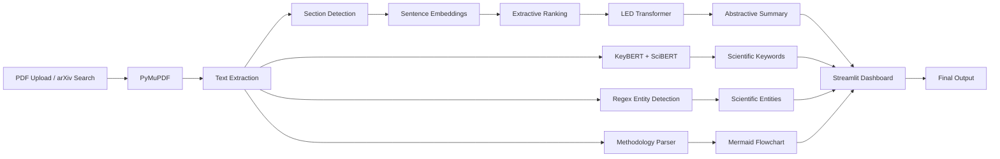

# AI-Powered Research Paper Summarizer

> An NLP-powered application that automatically summarizes long scientific research papers using a hybrid Extractive–Abstractive pipeline. The system supports PDF uploads and arXiv integration, extracts scientific keywords and entities, generates methodology flowcharts, and provides an interactive interface for efficient literature review.


---

# Table of Contents

- [Overview](#overview)
- [Problem Statement](#problem-statement)
- [Key Features](#key-features)
- [System Architecture](#system-architecture)
- [Processing Pipeline](#processing-pipeline)
- [Technology Stack](#technology-stack)
- [Project Structure](#project-structure)

---

# Overview

Scientific research papers contain valuable knowledge but are often lengthy, highly technical, and time-consuming to understand. Researchers and students spend a significant amount of time reading multiple papers before identifying the most relevant information.

This project presents an AI-powered research paper summarization system that automatically extracts and summarizes important information from scientific publications using modern Natural Language Processing (NLP) techniques.

The system combines semantic extractive summarization with transformer-based abstractive summarization to generate concise, coherent, and context-aware summaries while preserving the technical meaning of the original paper.

In addition to summarization, the application extracts scientific keywords, identifies important entities such as models and datasets, and generates methodology flowcharts to improve comprehension of research workflows.

The application provides a simple Streamlit-based interface where users can upload research papers in PDF format or retrieve papers directly from arXiv.

---

# Problem Statement

With thousands of scientific papers published every day, manually reviewing literature has become increasingly challenging.

Traditional summarization techniques often suffer from one or more of the following limitations:

- Poor understanding of scientific terminology
- Loss of contextual information
- Fragmented sentence selection
- Inability to process long research papers
- Lack of structured insights for technical documents

This project addresses these challenges by combining extractive and abstractive NLP techniques specifically designed for long scientific documents.

---

# Key Features

- Automatic research paper summarization
- Upload research papers in PDF format
- Search and retrieve papers directly from arXiv
- Hybrid Extractive + Abstractive summarization pipeline
- Long document processing using LED Transformer
- Scientific keyword extraction using KeyBERT and SciBERT
- Scientific entity extraction
- Section-wise summarization
- Automatic methodology flowchart generation
- Interactive Streamlit web application
- Export generated summaries
- Docker support for deployment

---

# System Architecture



---

# Processing Pipeline

```
Research Paper
       │
       ▼
PDF Extraction
       │
       ▼
Text Cleaning
       │
       ▼
Section Detection
       │
       ▼
Sentence Embedding Generation
       │
       ▼
Extractive Sentence Ranking
       │
       ▼
LED Abstractive Summarization
       │
       ▼
Keyword Extraction
       │
       ▼
Entity Recognition
       │
       ▼
Methodology Flowchart
       │
       ▼
Interactive Streamlit Interface
```

---

# Technology Stack

| Category | Technology |
|-----------|------------|
| Programming Language | Python |
| Frontend | Streamlit |
| Deep Learning Framework | PyTorch |
| NLP Framework | Hugging Face Transformers |
| Abstractive Summarization | LED (Longformer Encoder Decoder) |
| Extractive Summarization | Sentence Transformers |
| Keyword Extraction | KeyBERT |
| Scientific Embeddings | SciBERT |
| PDF Processing | PyMuPDF |
| Data Source | arXiv API |
| Deployment | Docker |
| Version Control | Git & GitHub |

---

# Project Structure

```text
Research-Paper-Summarizer
│
├── data/
├── models/
├── notebooks/
├── references/
├── reports/
├── scripts/
├── src/
│   ├── backend/
│   └── frontend/
│
├── README.md
├── docker-compose.yaml
├── .gitignore
└── ResearchPaperSummarizer.ipynb
```

---

The following sections describe the implementation details, NLP models, workflow, experimental evaluation, installation instructions, and usage of the system.
